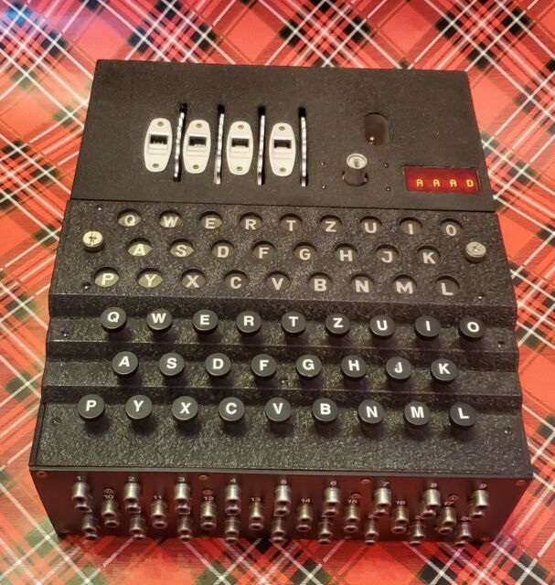
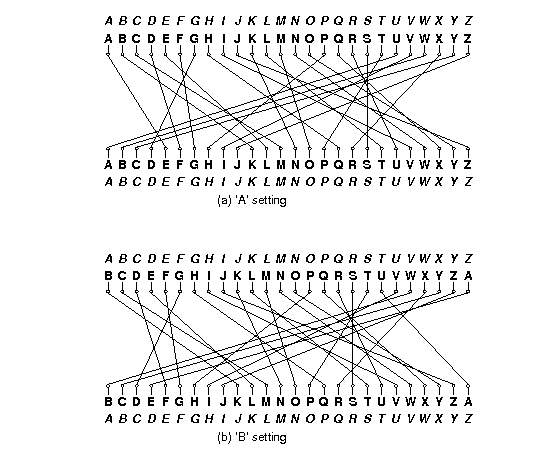

The Enigma
=============
###### Data Structures (CS61B-Fa19) taught by Prof. Hilfinger at UC Berkeley 
### CS61B project 2

--------------------------

# Background

You may have heard of the Enigma machines that Germany used during World War II to encrypt its military communications. If you have not, I recommend you read the wikipedia page on them, or similar resource, especially the part about design and operation. This project involves building a simulator for a generalized version of this machine (which itself had several different versions.) Your program will take descriptions of possible initial configurations of the machine and messages to encode or decode (the Enigma algorithms were reciprocal, meaning that encryption is its own inverse operation.)

The Enigmas effect a substitution cipher on the letters of a message. That is, at any given time, the machine performs a permutation—a one-to-one mapping—of the alphabet onto itself. The alphabet consists solely of the 26 letters in one case (there were various conventions for spaces and punctuation).

Plain substitution ciphers are easy to break (you've probably seen puzzles in newspapers that consist of breaking such ciphers). The Enigma, however, implements a progressive substitution, different for each subsequent letter of the message. This made decryption considerably more difficult.

The device consists of a simple mechanical system of (partially) interchangeable rotors (Walzen) that sit side-by-side on a shaft and make electrical contact with each other. Most of these rotors have 26 contacts on both sides, which are wired together internally so as to effect a permutation of signals coming in from one side onto the contacts on the other (and the inverse permutation when going in the reverse direction). To the left of the rotors, one could select one of a set of reflectors (Umkehrwalzen), with contacts on their right sides only, and wired to connect half of those contacts to the other half. A signal starting from the rightmost rotor enters through one of the 26 possible contacts, flows through wires in the rotors, "bounces" off the reflector, and then comes back through the same rotors (in reverse) by a different route, always ending up being permuted to a letter position different from where it started; that is, the permutation was always a derangement. (This was a significant cryptographic weakness, as it turned out. It doesn't really do a would-be code-breaker any good to know that some letters in an encrypted message might be the same as the those in the plaintext if he doesn't know which ones. But it does a great deal of good to be able to eliminate possible decryptions because some of their letters are the same as in the plaintext.)

Each rotor and each reflector implements a different permutation, and the overall effect depends on their configuration: which rotors and reflector are used, what order they are placed in the machine, and which rotational position they are initially set to. This configuration is the first part of the secret key used to encrypt or decrypt a message. In what follows, we'll refer to the selected reflector and rotors in a machine's configuration as 1 through N, with 1 being the reflector, and N the rightmost rotor. In our simulator, N will be a configuration parameter. In actual Enigma machines, it was fixed for any given model (the Kreigsmarine (Navy) used N=5 (four rotors and reflector) and the Wehrmacht used N=4.)

The overall permutation changes with each successive letter because some of the rotors rotate after encrypting a letter. Each rotor has a circular ratchet on its right side and an "alphabet ring" on its left side that fits over the ratchet of the rotor to its left. Before a letter of a message is translated, a spring-loaded pawl (lever)—one to the right of each rotating rotor—tries to engage the ratchet on the right side of its rotor and thus rotate its rotor by one position, changing the permutation performed by the rotor. Thus, pawls always try to engage with the ratchet of their own rotor. The lever on the rightmost rotor (N) always succeeds, so that rotor N (the "fast" rotor) rotates one position before each character. The pawls pushing the other rotors, however, are normally blocked from engaging their rotors by the alphabet ring on the left side of the rotor to their right. This interactive website provides a good visualization of how signals travel through the rotors and how messages are encrypted. DISCLAIMER: This visualizer does not depict the underlying details of how rotors rotate. It's just a tool that may help your understanding of how the electrical signals propagate through the system.

This ring usually holds the pawl away from its own ratchet, preventing the rotor wheel to its left from moving. However, the rings have notches in them (either one or two in the original Enigma machines), and when the pawl is positioned over a notch in the ring for the rotor to its right, it slips through to its own rotor and pushes it forward. A "feature" of the design called "double stepping" (corrected in other versions of the Enigma, since it reduced the period of the cipher) is that when a pawl is in a notch, it also moves the notch itself and the rotor the notch is connected to. Since the notch for rotor i is connected to rotor i, when the pawl of rotor i−1 slips through into the notch for rotor i, rotors on both sides of the pawl move (so rotor i−1 and rotor i move).

Let's illustrate with a much simplified version. Suppose our alphabet has only the letters A-C and we have four rotors (numbered 1-4) each of which has one notch on its ring at the C position. Suppose also that there are 3 pawls, one for each of rotors 2-4. We will still refer to these as pawls 2-4, to maintain that pawl i belongs to rotor i. There is no pawl for rotor 1, which will therefore not rotate. We'll start with the rotors set at AAAA. The next 19 positions are as follows:

AAAB  AAAC  AABA  AABB  AABC  AACA  ABAB  ABAC
ABBA  ABBB  ABBC  ABCA  ACAB  ACAC  ACBA  ACBB
ACBC  ACCA  AAAB
As you can see,

Rotor 4, the fast rotor, advances each time, pushed by pawl 4. Rotor 4 has no rotor to its right, so there isn't a ring blocking it from engaging with its ratchet.
Rotor 3 advances whenever Rotor 4 is at C. Rotor 4 has a notch at C, so pawl 3 can engage with the corresponding ratchet (the ratchet belonging to Rotor 3) and advance Rotor 3 by pushing on its ratchet. This would also rotate Rotor 4, since pawl 3 contacts its ratchet through the notch of Rotor 4, and therefore pushes the side of the notch when it moves. However, since Rotor 4 always rotates anyway (because pawl 4 is always unblocked), this doesn't really change anything.
Rotor 2 advances whenever Rotor 3 is at C, pushed by pawl 2. Rotor 3 has a notch at C, so pawl 2 slips into the notch and engages with its ratchet (the ratchet belonging to Rotor 2). Rotor 3 also advances when it is at C, because when pawl 2 is engaged through Rotor 3's notch it will push against that notch when it moves, moving Rotor 3, as well as moving Rotor 2 by pushing on Rotor 2's ratchet.
There is no pawl 1, so Rotor 2 (unlike Rotor 3) does not advance just because it is at C.
Rotor 1 never changes, since there is no pawl on either side of it.
Each rotor can only advance at most one position per keypress.

So the advancement of the rotors, while similar to that of the wheels of an odometer, is not quite the same. If it were, then the next position after AACA would be AACB, rather than ABAB. Also, it would take 27 steps to return to the initial configuration instead of 18.

The effect of advancing a wheel is to change where on the wheel any given signal enters or leaves. When a wheel is in its 'A' setting in the machine, then a signal that arrives from the right at, say, the 'C' position, goes into the 'C' contact on the wheel. Likewise, a signal that leaves the wheel from its left 'C' contact exits at the 'C' position. When the wheel is rotated by one to its 'B' setting, a signal that arrives at the 'C' position goes instead into the 'D' contact on the wheel, and a signal that leaves through the 'D' contact does so at the 'C' position. It's easier to calculate if we use numbers 0--25 rather than letters ('A' is 0, 'B' is 1, etc.). Then, when the wheel is in its k setting, a signal entering at the p position enters the p+kmod26 contact on the wheel, and a signal exiting through the c contact does so at the c−kmod26 position. For example, Figure 1 shows one of the rotors from the real Enigma machines (called rotor "I") and the effect of moving from its 'A' to its 'B' setting.

#Rotor Example

Figure 1. Permutations performed by a rotor in its 'A' and 'B' settings. The italicized alphabets at the top and bottom indicate the letters corresponding to the positions around the rotor. The inner alphabets indicate the positions along the rotor itself. The rotor depicted was designated 'I' in the original Enigma machine used by the German military.

The contacts on the rightmost rotor's right side connect with stationary input and output contacts, which run to keys that, when pressed, direct current to the contact from a battery or, when not pressed, direct current back from the contact to a light bulb indicating a letter of the alphabet. Since a letter never encrypts or decrypts to itself after going back and forth through the rotors, the to and from directions never conflict.

The German Navy used a machine with 12 rotors and five slots for them:

Eight rotors labeled with roman numerals I--VIII, of which three will be used in any given configuration as the rightmost rotors,
Two additional non-moving rotors (Zusatzwalzen) labeled "Beta" and "Gamma", of which one will be used in any configuration, as the fourth-from-right rotor, and
Two reflectors (Umkehrwalzen), labeled 'B' and 'C', of which one will be used in any given configuration as the leftmost rotor.
Given just this equipment, there are 614,175,744 possible configurations (or keys):

Two possible reflectors, times
Two possible rotors in the fourth position, times
8!/(8−3)!=336 choices for the rightmost three rotors and their ordering, times
264 possible initial rotational settings for the rightmost four rotors (each reflector had only one possible position.).
Especially by today's standards, this is not a large key size (less than 30 bits). To make things more difficult for code-breakers, therefore, the Enigma incorporated a plugboard (Steckerbrett) between the keyboard and the rightmost wheel. It acted as a non-moving, configurable rotor. The operator could choose any set of disjoint pairs of letters by means of cables placed between them on the plugboard. Each selected pair would then be swapped going into the machine from the keyboard and coming out into the indicator lights. Thus, if the operator connected ("steckered") the letters A and P, then P would be substituted for each A typed and vice versa. Likewise, if an ingoing letter was encrypted to P by the other rotors, it would display as A, and letters decrypted as A would display as P.

Describing Permutations
Since the rotors and the plugboard implement permutations, we'll need a standard way to describe them. We could simply have a table showing each letter and what it maps to, but we'll use a more compact notation known as cycle representation. The idea is that any permutation of a set may be described as a set of cyclic permutations. For example, the notation

(AELTPHQXRU) (BKNW) (CMOY) (DFG) (IV) (JZ) (S)
describes the permutation in Figure 1. It describes seven cycles:

A maps to E, E to L, L to T, ..., R to U, and U back to A.
B maps to K, K to N, N to W, and W back to B.
C maps to M, M to O, O to Y, and Y back to C.
D maps to F, F to G, and G back to D.
I maps to V and V back to I.
J maps to Z and Z back to J.
S maps to itself.
The inverse permutation just reverses these cycles:

U maps to R, R to X, ..., E to A, and A back to U.
...
S maps to itself.
Each letter appears in one and only one cycle, so the mapping is unambiguous. As a shorthand, we'll say that if a letter is left out of all cycles, it maps to itself (so that we could have left off "(S)" In the example above.)

Figure 2 shows the permutations corresponding to the rotors used in the German Navy's Enigma machine.

Rotor	Permutation (as cycles)	Notch
Rotor I	(AELTPHQXRU) (BKNW) (CMOY) (DFG) (IV) (JZ) (S)	Q
Rotor II	(FIXVYOMW) (CDKLHUP) (ESZ) (BJ) (GR) (NT) (A) (Q)	E
Rotor III	(ABDHPEJT) (CFLVMZOYQIRWUKXSG) (N)	V
Rotor IV	(AEPLIYWCOXMRFZBSTGJQNH) (DV) (KU)	J
Rotor V	(AVOLDRWFIUQ)(BZKSMNHYC) (EGTJPX)	Z
Rotor VI	(AJQDVLEOZWIYTS) (CGMNHFUX) (BPRK)	Z and M
Rotor VII	(ANOUPFRIMBZTLWKSVEGCJYDHXQ)	Z and M
Rotor VIII	(AFLSETWUNDHOZVICQ) (BKJ) (GXY) (MPR)	Z and M
Rotor Beta	(ALBEVFCYODJWUGNMQTZSKPR) (HIX)
Rotor Gamma	(AFNIRLBSQWVXGUZDKMTPCOYJHE)
Reflector B	(AE) (BN) (CK) (DQ) (FU) (GY) (HW) (IJ) (LO) (MP) (RX) (SZ) (TV)
Reflector C	(AR) (BD) (CO) (EJ) (FN) (GT) (HK) (IV) (LM) (PW) (QZ) (SX) (UY)
Figure 2. The rotors used in the Naval Enigma, showing the permutations they> implement and the point(s) at which there are notches that allow their left neighbor rotor to advance. Thus, when Rotor I is at 'Q' and the machine advances, the rotor to the left of Rotor I will advance. The Beta and Gamma rotors and the reflectors do not rotate. The reflectors shown here are the "thin" versions of the reflectors used in the naval M4 Enigma machine. The B reflector together with the Beta rotor in the 'A' position had the same effect as the usual ("thick") B reflector in the older three-rotor M3 Enigma machine (likewise the C reflector with the Gamma rotor). This allowed the M4 to encrypt and decrypt messages to and from M3 Enigmas. Source: Tony Sale's pages.

Example
As an example of a translation, consider the set of rotors from Figure 2, and suppose that

The rotors in positions 1--5 are, respectively, B, Beta, III, IV, and I.
The rotors in positions 2--5 are currently at positions A, X, L, E, respectively.
In the plugboard, the letter pair 'Y' and 'F' and the letter pair 'Z' and 'H' are both interchanged.
We input the letter 'Y', which causes the following steps:

The pawls all move. This causes rotor 5 to advance from E to F. The other two pawls are not over notches, so rotors 3 and 4 do not move.
The letter 'Y' enters the plugboard and is converted to 'F'.
The letter 'F' enters the right side of rotor 5 (an I rotor) at position 5, since 'F' is the 5th letter of the alphabet numbering from 0. Since the current setting of rotor 5 is 'F', the signal enters the rotor at position 5, but hits contact 5+5=10, or 'K'.
According to Figure 2, rotor I converts 'K' to 'N' (letter number 13). Because the setting of rotor I is 'F', however, the signal actually comes out at letter position 13−5=8 ('I').
The 'I' signal from rotor 5 now goes into the right side of rotor 4. Since rotor 4 is a IV rotor and is in the 'L' (or 11) setting, the 'I' enters at contact 8+11=19 ('T'), and is translated to 'G' (6), which comes out at position 6−11=−5=21mod26, the fifth letter from the end of the alphabet ('V').
The 'V' from rotor 4 goes now to the right side of rotor 3, a III rotor in setting 'X' (23). The signal enters the rotor at contact 21+23=44=18mod26 ('S'), is translated to 'G' (6), which exits at position 6−23=−17=9mod26 ('J').
Rotor 2 (Beta) is in position 'A', and thus translates 'J' to 'W'.
Rotor 1 (B) converts the 'W' to 'H' and bounces it back to the left side of rotor 2.
Rotor 2 (Beta in the 'A' position) converts 'H' on its left to 'X' (23) on its right.
The 'X' from rotor 2 now goes into the 23+23=46=20mod26 ('U') contact on the left side of rotor 3 (III in setting 'X'), and is converted to 'W' (22), which comes out at position 22−23=−1=25mod26 ('Z') on the right side of rotor 3.
'Z' now enters the left side of rotor 4 (IV in setting 'L') at 25+11=36=10mod26 ('K'), and is translated to 'U' (20), which comes out at position 20−11=9 ('J') on the right side of rotor 4.
The 'J' from rotor 4 enters the left side of rotor 5 (I at setting 'F') at contact 9+5=14 ('O'), is translated to 'M' (12), and comes out at position 12−5=7 ('H') on the right side of rotor 5.
Finally,the letter 'H' is converted to 'Z' by the plugboard.
Therefore, 'Y' is converted to 'Z'.

After a total of 12 characters are converted, the rotor settings will have become 'AXLQ'. Just before the next character is converted, rotor 5 will advance to 'R' and, since its notch is at position 'Q', rotor 4 will advance to 'M', so that the rotor configuration will be 'AXMR' before the 13th character is converted. After an additional 597 characters have been converted, the configuration will be 'AXIQ'. The character after that will advance rotor 5 to 'R' and rotor 4 to 'J', giving 'AXJR'. The next character will advance 5 to 'S', and, since rotor IV's notch is at 'J', rotor 3 will advance to 'Y'. Also, as rotor 3's pawl advances rotor 3, it also moves the notch on rotor 4, advancing rotor 4 to 'K', so that the configuration goes from 'AXJR' to 'AYKS'. Rotor 3 in this case has a notch at 'V', but since rotor 2 has no pawl, rotor 3's notch never has any effect.

Input and Output
To run your program on the command line, first compile all of your files with

    javac -g -Xlint:unchecked enigma/*.java
or, if you have it, just use

    make
After compiling, you can use the command

    java -ea enigma.Main [configuration file] [input file] [output file]
to run your program. The configuration file contains descriptions of the machine and the available rotors. The data are in free format. That is, they consist of strings of non-whitespace characters separated by arbitrary whitespace (spaces, tabs, and newlines), so that indentation, spacing, and line breaks are irrelevant. Each file has the following contents:

A string of the form C1C2⋯Cn where the Ci are non-blank ASCII characters other than "*", "(" and ")". This is the alphabet of the machine, giving both the character set and the ordering of the characters around a rotor. For the examples in this document, we use just the upper-case alphabet (as did the Enigma machines), but your solution must deal with general alphabets. In the following, we will generally refer to the characters in this alphabet as "letters", even when they include digts, punctuation, or other symbols.
Two integer numerals, S>P≥0, where S is the number of rotor slots (including the reflector) and P is the number of pawls—that is, the number of rotors that move. The moving rotors and their pawls are all to the right of any non-moving ones.
Any number of rotor descriptors. Each has the following components (separated by whitespace):

A name containing any non-blank characters other than parentheses.
One of the characters R, N, or M, indicating that the rotor is a reflector, a non-moving rotor, or a moving rotor, respectively. Non-moving rotors can only be used in positions 2 through S−P and moving rotors in positions S−P+1 through S.
Immediately after the M for a moving rotor come(s) the letter(s) at which there is a notch on the rotor's ring (no space between M and these letters).
The cycles of the permutation, using the notation discussed above.
For example, the German Naval Enigma machine might be described with this configuration file (see Figure 2):

          ABCDEFGHIJKLMNOPQRSTUVWXYZ
          5 3
          I MQ      (AELTPHQXRU) (BKNW) (CMOY) (DFG) (IV) (JZ) (S)
          II ME     (FIXVYOMW) (CDKLHUP) (ESZ) (BJ) (GR) (NT) (A) (Q)
          III MV    (ABDHPEJT) (CFLVMZOYQIRWUKXSG) (N)
          IV MJ     (AEPLIYWCOXMRFZBSTGJQNH) (DV) (KU)
          V MZ      (AVOLDRWFIUQ)(BZKSMNHYC) (EGTJPX)
          VI MZM    (AJQDVLEOZWIYTS) (CGMNHFUX) (BPRK)
          VII MZM   (ANOUPFRIMBZTLWKSVEGCJYDHXQ)
          VIII MZM  (AFLSETWUNDHOZVICQ) (BKJ) (GXY) (MPR)
          Beta N    (ALBEVFCYODJWUGNMQTZSKPR) (HIX)
          Gamma N   (AFNIRLBSQWVXGUZDKMTPCOYJHE)
          B R       (AE) (BN) (CK) (DQ) (FU) (GY) (HW) (IJ) (LO) (MP)
                    (RX) (SZ) (TV)
          C R       (AR) (BD) (CO) (EJ) (FN) (GT) (HK) (IV) (LM) (PW)
                    (QZ) (SX) (UY)
The input file to your program will consist of a sequence of messages to decode, each preceded by a line giving the initial settings. Given the configuration file above, a settings line looks like this:

* B Beta III IV I AXLE (YF) (ZH)
The asterisk must appear in the first column. Other items on the line may be separated from each other by tabs and blanks; adjacent items that are rotor names or consist entirely of letters from the alphabet must be so separated. This particular example means that the rotors used are reflector B, and rotors Beta, III, IV, and I, with rotor I in the rightmost, or fast, slot. The remaining parenthesized items indicate that the letter pair Y and F and the pair Z and M are steckered (swapped going in from the keyboard and going out to the lights).

In general for this particular configuration, rotor 1 is always the reflector; rotor 2 is Beta or Gamma, and each of 3-5 is one of rotors I-VIII. A rotor may not be repeated. The four letters of the following word (AXLE in the example) give the initial positions of rotors 2-5, respectively (i.e., not including the reflector). Any number of steckered pairs may follow (including none).

After each settings line comes a message on any number of lines. Each line of a message consists only of letters (here meaning characters from the specified alphabet), spaces, and tabs (0 or more). The program should ignore the blanks and tabs. The end of message is indicated either by the end of the input or by a new configuration line (distinguished by its leading asterisk). The machine is not reset between lines, but continues stepping from where it left off on the previous message line. Because the Enigma is a reciprocal cipher, a given translation may either be a decryption or encryption; you don't have to worry about which, since the process is the same in any case.

Output the translation for each message line in groups of five characters, separated by a space (the last group may have fewer characters, depending on the message length). Figure 3 contains an example that shows an encryption followed by a decryption of the encrypted message. Since we have yet to cover the details of File I/O, you will be provided the File IO machinery for this project.

             Input                              |         Output
* B Beta III IV I AXLE (HQ) (EX) (IP) (TR) (BY) | QVPQS OKOIL PUBKJ ZPISF XDW
FROM HIS SHOULDER HIAWATHA                      | BHCNS CXNUO AATZX SRCFY DGU
TOOK THE CAMERA OF ROSEWOOD                     | FLPNX GXIXT YJUJR CAUGE UNCFM KUF
MADE OF SLIDING FOLDING ROSEWOOD                | WJFGK CIIRG XODJG VCGPQ OH
NEATLY PUT IT ALL TOGETHER                      | ALWEB UHTZM OXIIV XUEFP RPR
IN ITS CASE IT LAY COMPACTLY                    | KCGVP FPYKI KITLB URVGT SFU
FOLDED INTO NEARLY NOTHING                      | SMBNK FRIIM PDOFJ VTTUG RZM
BUT HE OPENED OUT THE HINGES                    | UVCYL FDZPG IBXRE WXUEB ZQJO
PUSHED AND PULLED THE JOINTS                    | YMHIP GRRE
   AND HINGES                                   | GOHET UXDTW LCMMW AVNVJ VH
TILL IT LOOKED ALL SQUARES                      | OUFAN TQACK
   AND OBLONGS                                  | KTOZZ RDABQ NNVPO IEFQA FS
LIKE A COMPLICATED FIGURE                       | VVICV UDUER EYNPF FMNBJ VGQ
IN THE SECOND BOOK OF EUCLID                    |
                                                | FROMH ISSHO ULDER HIAWA THA
* B Beta III IV I AXLE (HQ) (EX) (IP) (TR) (BY) | TOOKT HECAM ERAOF ROSEW OOD
QVPQS OKOIL PUBKJ ZPISF XDW                     | MADEO FSLID INGFO LDING ROSEW OOD
BHCNS CXNUO AATZX SRCFY DGU                     | NEATL YPUTI TALLT OGETH ER
FLPNX GXIXT YJUJR CAUGE UNCFM KUF               | INITS CASEI TLAYC OMPAC TLY
WJFGK CIIRG XODJG VCGPQ OH                      | FOLDE DINTO NEARL YNOTH ING
ALWEB UHTZM OXIIV XUEFP RPR                     | BUTHE OPENE DOUTT HEHIN GES
KCGVP FPYKI KITLB URVGT SFU                     | PUSHE DANDP ULLED THEJO INTS
SMBNK FRIIM PDOFJ VTTUG RZM                     | ANDHI NGES
UVCYL FDZPG IBXRE WXUEB ZQJO                    | TILLI TLOOK EDALL SQUAR ES
YMHIP GRRE                                      | ANDOB LONGS
GOHET UXDTW LCMMW AVNVJ VH                      | LIKEA COMPL ICATE DFIGU RE
OUFAN TQACK                                     | INTHE SECON DBOOK OFEUC LID
KTOZZ RDABQ NNVPO IEFQA FS                      |
VVICV UDUER EYNPF FMNBJ VGQ                     |
Figure 3. Sample input and output (using the Naval cipher).
